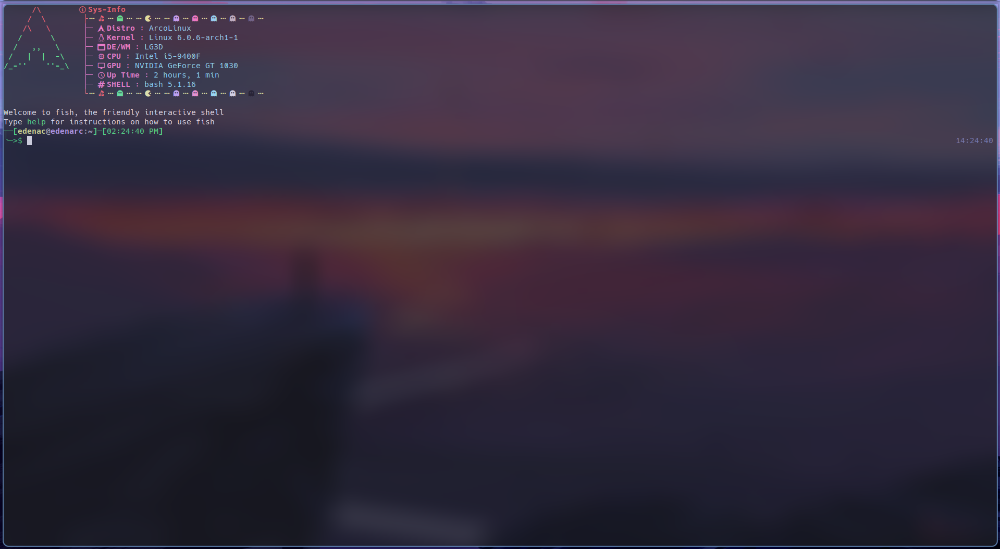
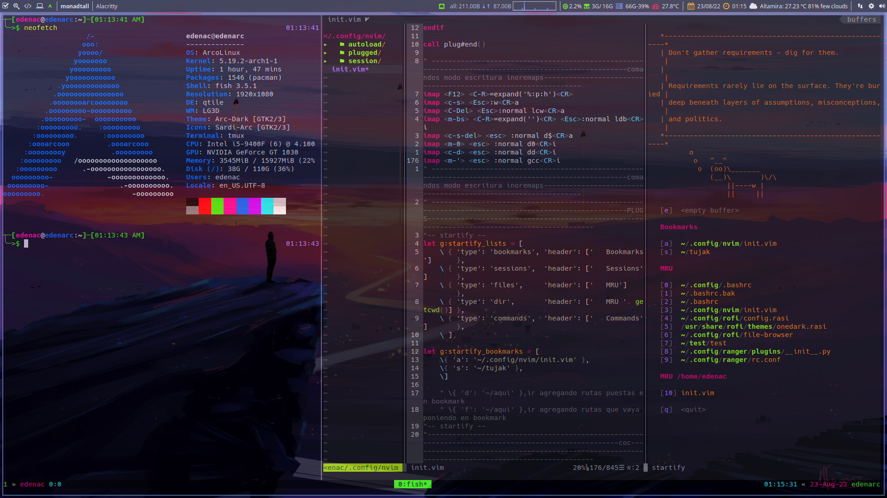
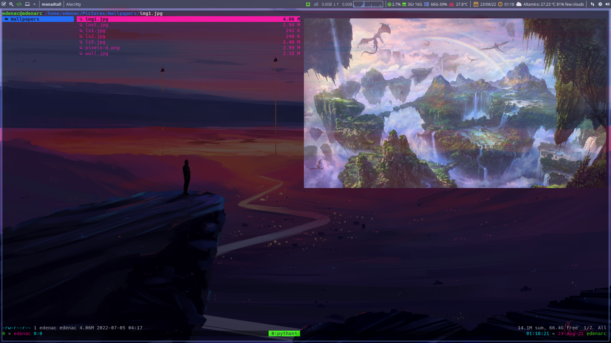
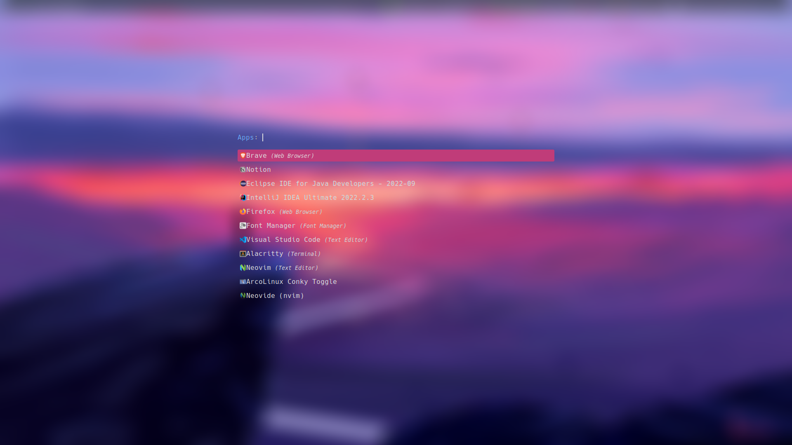
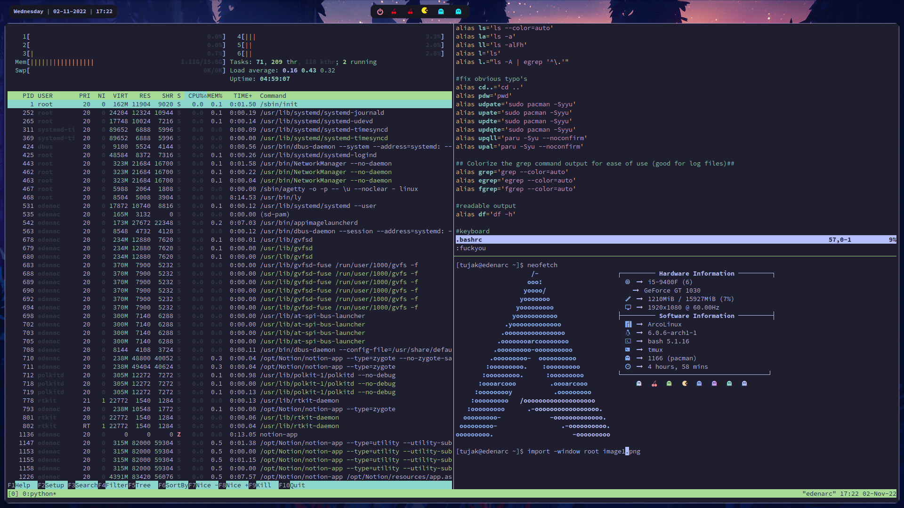
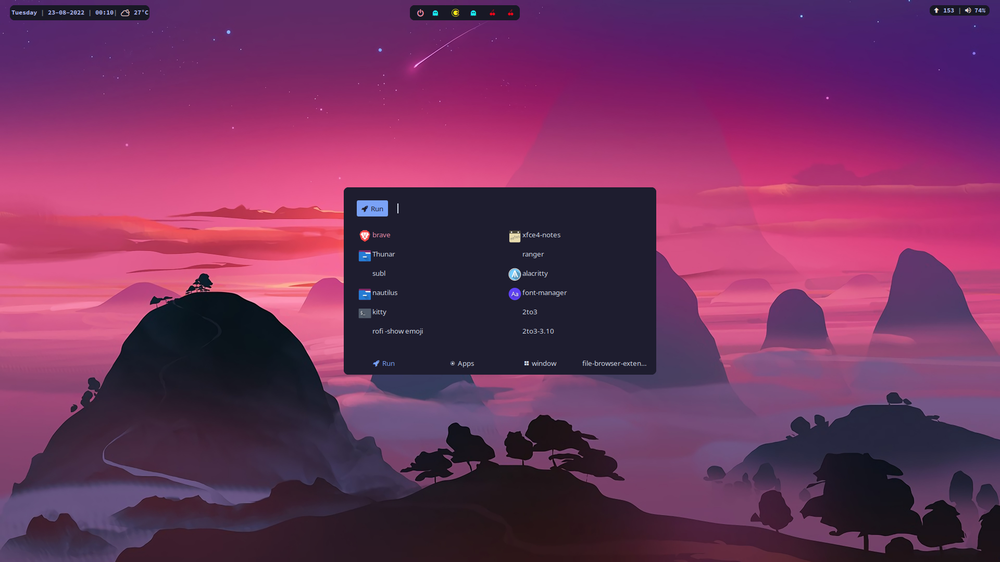

# myArcoDotFiles
all my dotfiles on archlinux --> arcolinux --> awesome & qtile
 
 
## qtile

### (ueberzug and pillow-simd to display image on terminal)
https://github.com/seebye/ueberzug
 https://github.com/uploadcare/pillow-simd
 
 

 
 
## awesome
Install this catpuccin sh for the polybar pwermenu
https://github.com/catppuccin/gtk
 

